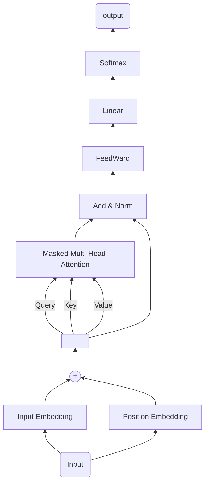
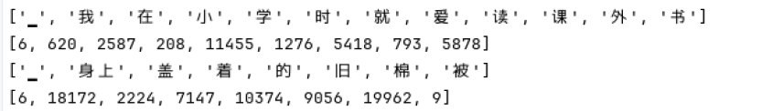
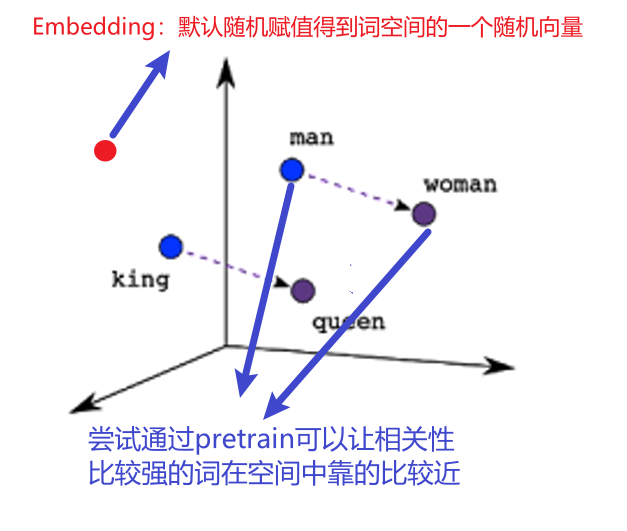
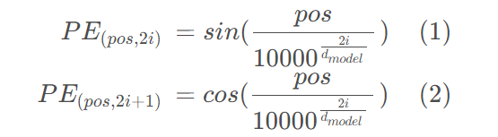
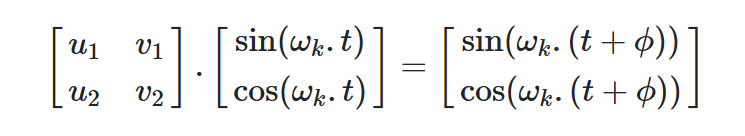
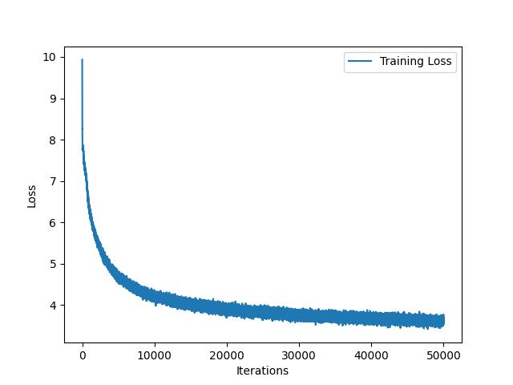
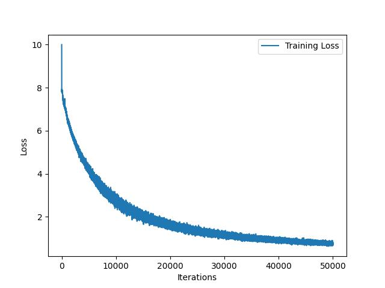
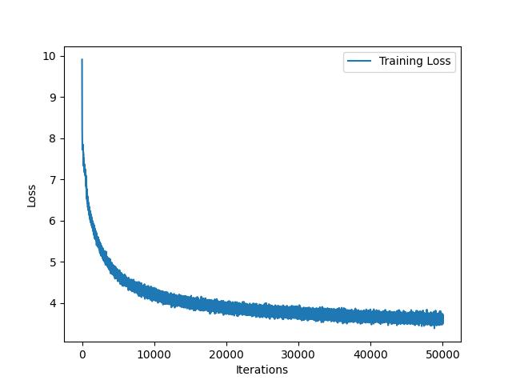

# Nano-GPTsimple

```
|--AI-design
  |--model.py
  |--train.py
  |--assets
  |--dataset
  |--result
  |--readme.md
  |--test.py
```

## Model Architecture

- 最终实现的Nano-GPTsimple结构如下图所示：



## Data set

- 使用SentencePiece分词器模型,对中文文本进行学习，得到`Tokenizer`和`Detokenizer`

```python
import sentencepiece as spm
spm.SentencePieceTrainer.Train(
  input=fname,model_prefix=prefix,vocab_size=config.vocab_size,)
#得到两个文件
#mydata.model 为得到的分词器模型，用于encode和decode
#mydata.vocab 是词汇表，得到对应的词和值
```

- 将文本数据进行分割编码之后，存入`train.dat`和`target.dat`当中

```python
#分词编码实验
print(sp.EncodeAsPieces("我在小学时就爱读课外书"))
print(sp.EncodeAsIds("为了使得读者易于分辨"))
print(sp.EncodeAsPieces("身上盖着的旧棉被"))
print(sp.EncodeAsIds("临走前韩父反复嘱咐韩立"))
```



## Input Embedding & Position embedding

```python
#Input Embedding
self.token_embedding_table = nn.Embedding(config.vocab_size,config.embedding_depth)
#Position embedding
self.position_embedding_table = PositionEmbedding(config)

#Position embedding with sin/cos
class PositionEmbedding(nn.Module):
    def __init__(self,config:myGPTConfig):
        super().__init__()
        d_model = config.embedding_depth
        seq_len = config.time_sequence_length
        position_embedding = torch.zeros(seq_len,d_model)
        #print(position_embedding)
        #position = torch.arrange(0,seq_len,dtype=torch.float)
        #pos = torch.arrange(0,seq_len,dtype=torch.float)
        #print(pos) #arange
        #print(pos.unsqueeze(0)) #Tensor[1,16]
        #print(pos.unsqueeze(1)) #Tensor[16,1]
        pos = torch.arange(0,seq_len,dtype=torch.float).unsqueeze(1)
        #print(pos.shape)
        parameter_divided = torch.exp(torch.arange(0,d_model,2).float() * (-math.log(10000.0)/d_model))
        #print(parameter_divided) #arrange
        position_embedding[:,0::2] = torch.sin(pos * parameter_divided) #boardcast mechanism
        position_embedding[:,1::2] = torch.cos(pos * parameter_divided) #pos[16,1] parameter_divided:arrange
        #print(position_embedding.shape)
        #print(position_embedding) #[seq_len,embedding_depth]
        #print(position_embedding.unsqueeze(0).shape) #[1,seq_len,embedding_depth]
        position_embedding = position_embedding.unsqueeze(0) #[1,seq_len,embedding_depth]
        self.register_buffer('sinusoid_pe',position_embedding)
    
    def forward(self,x):
        return self.sinusoid_pe[:,:x.shape[1],:]
```

> - nn.Embedding是PyTorch中的一个常用模块，其主要作用是将输入的整数序列转换为密集向量表示。在自然语言处理（NLP）任务中，可以将每个单词表示成一个向量。**但其随机赋值，不能反映词向量在词空间中的关系，如下图所示。**
>
>   

* ***Position embedding*** 采用了《Attention is All You Need》论文中的嵌入方法。*注意i是嵌入向量维度里的第i个元素*。



- 这种方法限制了位置向量在[0,1]范围内，同时可以通过一个*2x2*矩阵*M*表示位置的相关性，**可以解释为什么会在偶数的时候用sin，奇数的时候用cos**



## Masked Multi-Head attention

```python
#分割得到Q K V
self.attention = nn.Linear(config.embedding_depth, 3 * config.embedding_depth, bias=config.bias)

#多头
self.head_numbers = config.head_numbers
#下三角矩阵隐藏未来的输出(猜测是一个生成文本模型，在训练时不能注意到未来的输出)
self.register_buffer("mask",torch.tril(torch.ones(config.time_sequence_length, config.time_sequence_length))
                          .view(1, 1, config.time_sequence_length, config.time_sequence_length))
#该层的forward函数
B,T,C = x.size() #B:batch size T:sequence length C:embedding dimensionality
q,k,v = self.attention(x).split(self.embedding_depth,dim=2)
q = q.view(B, T, self.head_numbers, C // self.head_numbers).transpose(1, 2)
k = k.view(B, T, self.head_numbers, C // self.head_numbers).transpose(1, 2)
v = v.view(B, T, self.head_numbers, C // self.head_numbers).transpose(1, 2)
att = (q @ k.transpose(-2, -1)) * (1.0 / math.sqrt(k.size(-1)))
att = att.masked_fill(self.mask[:, :, :T, :T] == 0, float('-inf'))
att = F.softmax(att, dim=-1)           
att = self.attention_dropout(att)
y = att @ v
y = y.transpose(1, 2).contiguous().view(B, T, C)
return self.proj(y)
#最后使用了一个线性层对计算得到的y进行了一个projection
#但投影矩阵是同一个维度的
#为什么这样做还没有搞清楚，参考kaipathy/nanoGPT
#self.proj = nn.Linear(config.embedding_depth, config.embedding_depth, bias=config.bias)
```

## Add & Norm &Feedward

```python
#残差连接
x = x + self.attn(self.ln1(x))
#但在进入注意力层之前还进行了LayerNorm
self.ln1 = nn.LayerNorm(config.embedding_depth,bias=config.bias)
self.attn = SelfAttention(config)
#注意力之后的LayerNorm和Feedward
x = x + self.ffn(self.ln2(x))
self.ln2 = nn.LayerNorm(config.embedding_depth, bias=config.bias)
self.ffn = FeedForward(config)
#查了一下资料
#FeedForward的作用是：通过线性变换，先将数据映射到高纬度的空间再映射到低纬度的空间，提取了更深层次的特征
```

## Linear 和Softmax

```python
#又进行了层归一化
x = self.layer_norm(x)
#通过线性层
logits = self.final_linear(x)
#通过softmax
probs = F.softmax(logits, dim=-1)
```

## Train

- 得到结果的训练共有三次，所得到`loss`分别为`3.626`,`0.759`,`3.606`



- 如果直接从文中选择文本，进行生成，三种训练结果的对比如下所示。在长文本(200字)的情况下，模型有了一定的逻辑性。`loss:0.759`情况下，多次输出了成语`名不虚传`,`灵光一闪`等，但整体的逻辑仍然稍有些混乱。这可能与训练文本的语法比较复杂有关。并且，选择文中本来就有的文本，模型也并不能和文中的文本相对应。

```text
loss:0.759
输入: 毕竟韩立第二元婴，一看就是
毕竟韩立第二元婴,一看就是真的修炼的其他神通,但对合体级的修士和灵躯掌握,对其根本是不可能的。而对几乎游口数丈,那名矮子也同样脸色发白起来。“雨老,我再在一旁和彩顾五情饮而尽,不会有何改变的。”蓝纹路听到赤影大喜,脸色一狠下,急忙谨慎的说道。接着他不再说话,单手一掐诀,背后灰光一闪,一对银色羽翅浮现而出。“轰”附近的天地元气一阵乱,中心处一下多出一个丈许大的黄色沙心出来。黄袍人在雾海中,一动不动起来。也不多,只是望着远处天空,嘴角的干笑声更多了几分。“这称呼高阶海兽‘纤纤’这名变异灵兽!这家伙可不下于炼虚级存在的三大灵界了,神通远非以前可比的。这般因为顶阶宝物,果然名不虚传!要不是第一波降伏,你们也不记得真正是此人的。现在听口气,法相已经在此界了。”老者本体微喃喃的低语了一句,同时脖颈上灵光一闪,一根黑云四下闪动着强大禁制灵光

```

```text
loss:3.626
输入: 毕竟韩立第二元婴，一看就是
韩立心中终于拿定了主意,有了决定。他可完全打算不让其他人再纠缠下去的时机,对如今的一名合体初期修士战力的本命云兽一族来说,实在是不死不休的事情,但在韩兄击杀了如此多修士情况下,这股老怪物笑容可不甚得不虚传,自然更加难分的了。一旁的银光仙子下意识的转眼间,二者竟然开始联手退进法阵中。青光一敛,韩立等人抬首一下看到了金色骄阳状亮光闪动的大鹏,而脸色一下阴沉似铁,双目紫目异光一闪一点指。顿时上来数条细丝向下一卷而过后,一枚细丝从细丝中激射而出,直接没入,没入白光中消失在了移动的回界之中。这时,正在地面银光闪动
```

```text
loss:3.606
输入: 毕竟韩立第二元婴，一看就是
下,丝毫不停留什么,一下将所有虚影撕裂在虚空的散发一下消失了。黑雨上人倒是反应之快,鬼魅般的直接将身形催动到了足下的山峰附近,青光一敛后,身形浮现而出。他的法相本体,已经现形而出,并单手一掐诀,体表金光一闪的狂闪不定起来,似乎凶性急展,雷鸣之声一片,仿佛千奇阵竟在一瞬间的晃动中。话音刚落,此山峰一声嗡鸣下,竟骤然间自行溃散开来。两座极山从四周也徐徐的到了韩立身前丈许,仿佛块利缓慢异常,死死的用肉身放出的灰色光刃圈禁之下的模样。见到此幕,韩立长吐了一口气,接着单手往手腕上和银尺遥遥一点,同时口中一声厉喝:“到了
```

- 如果选择文中没有的文本，其表现也并没有一些变差或者变好。
```text
loss:0.759
输入: 南宫婉在修炼中遇到瓶颈
南宫婉在修炼中遇到瓶颈时候,就不得不突破眼下瓶颈,可以在这魔劫将此功法提升到合体中期的境界。但纵然如此,还是早一步的突破几率提升之快,让神念压缩凝聚!无论对突破合体瓶颈的韩立,还是其他几个均感兴趣中的合体老怪,纷纷做出这等打算。就像韩立合体后期本尊这样,如何敢进入合体后期的妄想!不过无论哪方的韩某也都通过了,真到了此初期境界后,才机缘巧合的重新解除原来的冲破。不过此锣的效果明显不小,在元婴期和后期都能寸进的。光是传闻中的大乘级交换,其中记载的比人妖两族还让人望而弱。能以异族突破瓶颈限制的若想,机缘同样一望的,大概只有四分之一而已。而作为人妖两族最多的那第二人,自然也就打消了此念头,同样没有反对言语发生。如此一来,自然有的打算打算,梦装选一梦的梦单备上。以前,数次是被什么人戏称为‘万宝玉’

```

```text
loss:3.626
输入: 南宫婉在修炼中遇到瓶颈
原先炼制的修士,就是从书中修炼出来的上阶法器。现在韩立当年也得到了一个别二三十年的面子,只是应对了。其他人见到韩立,也没有这种表情,只能无奈的摇摇头。这时下面的韩立本人听见了,微微一笑声就打断了其他人的话语。“我的知道了,单凭这对手自要不齐了。”韩立沉默了一会儿,相信开口道。而那中年男子也恍然大悟地,知道这清楚对方后,立即动手将此物取与解了。“好!实在太邪门了,这可绝不是一名凡人的修士,教训大多数人。”“这难道真的是化神期修士吗?你想让本王加入雪吼兽呢?”炫烨王见此情形,恼怒
```

```text
loss:3.606
输入: 南宫婉在修炼中遇到瓶颈
刚一获得开启禁制,就将修为和元婴都赶给了此女。结果韩立释放的幻术一击而灭,但韩立脸上的灵光更无法直视,并且其中的紫罗极火忽暗忽明,但还没有减弱,随时来维持紫罗天火平衡了。“南宫婉将碎丹之身的话,本宫就用传音符给姑娘打劫了。”韩立一指自己以往的想法,微微一笑的说道。“这个......”一边思量,银衫女子也有点出洞府的特定议主,让三座子徒守在岛上。但从韩立那里得到的法阵禁制,已经现世的消息只是多翻了一番,其里面的那股高空中几番搜索,结果仅仅在不少地方,里面到处都是平坦的
```
